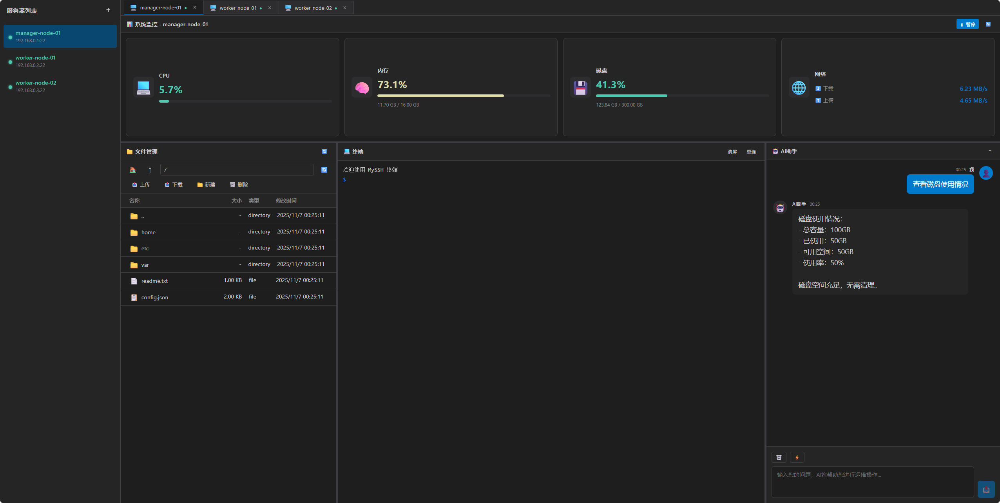

# MySSH - 远程服务器运维工具

一个类似 XShell 的现代化远程服务器运维工具，使用 Vue 3 + Tauri 构建。



## 功能特性

- 🖥️ **多服务器管理** - 支持同时管理多个服务器连接
- 💻 **终端标签页** - 每个服务器可开启多个终端标签页
- 📁 **文件管理器** - 可视化文件管理，支持上传下载
- 🎨 **现代化界面** - 深色主题，类似 VS Code 的设计风格
- ⚡ **高性能** - 基于 Tauri，原生性能

## 技术栈

- **前端框架**: Vue 3
- **状态管理**: Pinia
- **路由**: Vue Router
- **构建工具**: Vite
- **桌面框架**: Tauri
- **后端**: Rust (待实现)

## 项目结构

```
myssh/
├── src/
│   ├── components/          # Vue 组件
│   │   ├── ServerList.vue   # 服务器列表
│   │   ├── WorkspaceTabs.vue # 标签页容器
│   │   ├── TerminalTab.vue  # 终端组件
│   │   └── FileManagerTab.vue # 文件管理器
│   ├── views/               # 页面视图
│   │   └── MainLayout.vue   # 主布局
│   ├── stores/              # Pinia 状态管理
│   │   └── serverStore.js   # 服务器状态
│   ├── router/              # 路由配置
│   ├── App.vue              # 根组件
│   ├── main.js              # 入口文件
│   └── style.css            # 全局样式
├── package.json
├── vite.config.js
└── index.html
```

## 安装和运行

### 1. 安装依赖

```bash
npm install
```

### 2. 开发模式运行

```bash
npm run dev
```

### 3. 构建生产版本

```bash
npm run build
```

## 使用说明

### 添加服务器

1. 点击左侧服务器列表顶部的 `+` 按钮
2. 填写服务器信息：
   - 服务器名称（可选）
   - 主机地址（必填）
   - 端口（默认 22）
   - 用户名（必填）
   - 密码或密钥路径

### 连接服务器

1. 在服务器列表中点击服务器项
2. 点击 `▶` 按钮连接服务器
3. 连接成功后会自动打开终端标签页

### 使用终端

- 在终端中输入命令并回车执行
- 支持命令历史记录（上下箭头键）
- 点击"清屏"按钮清除终端输出
- 点击"重连"按钮重新连接服务器

### 使用文件管理器

1. 点击标签页区域的 `+` 按钮
2. 选择"文件管理"类型
3. 在文件管理器中：
   - 双击文件夹进入目录
   - 选择文件后点击"下载"按钮下载文件
   - 点击"上传"按钮上传本地文件
   - 点击"新建"按钮创建文件夹
   - 选择文件后点击"删除"按钮删除文件

## 待实现功能

以下功能已预留接口，等待接入 Tauri/Rust 后端：

- [ ] SSH 连接实现
- [ ] 终端命令执行
- [ ] 文件上传功能
- [ ] 文件下载功能
- [ ] 文件/文件夹创建和删除
- [ ] 密钥认证支持
- [ ] 连接状态管理
- [ ] 会话持久化

## 开发计划

1. ✅ 完成前端页面设计和实现
2. ⏳ 集成 Tauri 框架
3. ⏳ 实现 Rust 后端 SSH 功能
4. ⏳ 实现文件传输功能
5. ⏳ 添加配置保存和加载
6. ⏳ 优化用户体验

## 许可证

MIT

